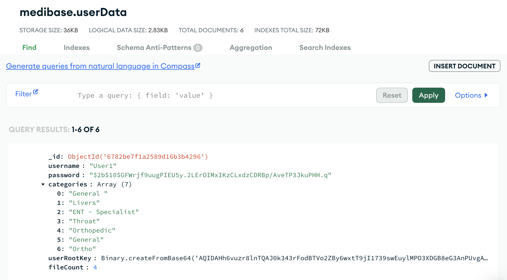

# Medibase 🏥

Medibase is a secure digital medical document manager that lets users upload, store, and share medical records across departments using blockchain and session-based access.

## 🔧 Project Structure

- `frontend/` – React-based UI
- `backend/` – Node.js + MongoDB API with session-based file sharing
- `Screenshots/` – UI and feature previews

## 📸 Screenshots

### Access Control

### Chat System

### File Management

### User Flow

### Data Overview

### System Diagram

## 🚀 Features

- MetaMask wallet integration
- Drag and drop document uploads
- Session ID-based doctor access
- IPFS and blockchain integration
- JWT session validation and email verification

---

Built with ❤️ by [your-name]
